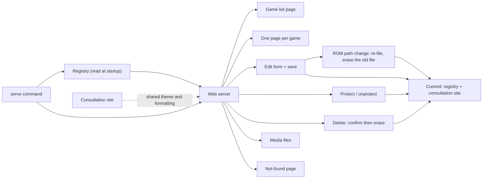

> Generated by /vibe:docs — manual edits will be overwritten; use README for hand-written content.

# Architecture

batocera-scrap-manager is organized around three main areas that work together to turn the scraping files already present on your ROMs folders into a centralized, browsable, up-to-date registry.

## The main parts

**Command-line interface**
The tool's entry point. It interprets the commands typed by the user (`config`, `update`, `scrape`, `remove`, `protect`, `unprotect`, `serve`, `--version`, `--help`) and displays results and error messages.

**Configuration**
Keeps track of two essential pieces of information between runs: where the registry lives, and which Batocera ROMs folders should be watched. This configuration is saved to disk and read back on every command.

**Game sheet reading (gamelist)**
Knows how to read `gamelist.xml` files, the standard format used by Batocera/EmulationStation to describe a system's games (name, description, cover art, video, rating, release date, developer, publisher, genre, number of players...).

**Registry**
The heart of the tool: a centralized index of all already-known games, along with their metadata and a copy of their media (cover art, video, marquee, thumbnail). It knows how to import game sheets from ROMs folders without creating duplicates, and to detect when the metadata of an already-known game has changed so it can be refreshed automatically.

**Consultation site**
Turns the registry's content into HTML, so it can be browsed in a web browser without opening individual metadata files. It is the shared presentation layer: it both writes the static site regenerated on every update, and provides the theme, the grouping by system and the formatting (rating stars, release year, safely encoded media links) reused by the web server, so both renderings stay consistent.

**Web server**
Serves the registry's content over HTTP on demand: a summary of the systems, one paginated list of games per system, one page per game, the form correcting a game's metadata and the ROM file identifying it, the page confirming a game's deletion, and the media files themselves. Unlike the static site, each game and each system has its own address, which is what makes a game reachable, linkable, editable and deletable.

**Commit of a registry change**
Writing the registry and regenerating the consultation site derived from it always go together, so the two never drift apart. Both the commands and the web server go through the same single place to do it, which also tells apart the case where the registry itself was written but only the site could not be regenerated.

## How data flows

1. The user specifies, via the configuration, where the registry lives and which ROMs folders to watch.
2. On every update, the tool scans the configured ROMs folders: each subfolder corresponds to a Batocera system (e.g. `megadrive`, `mastersystem`).
3. For each system, the `gamelist.xml` file (if it exists) is read and its games are compared against the content already present in the registry, with progress (the system name, then a counter for each game) displayed to the user as it happens.
4. An unknown game is added to the registry, and its media files are copied into the registry; an already-known game whose metadata changed is refreshed and its media re-copied; an already-known, unchanged game is left untouched, with no unnecessary copying. A game with neither a description nor a jaquette locally — meaning it has not actually been scraped yet — is skipped rather than added, so the registry only holds games with useful information. Instead of processing an entire ROMs folder, a single game can also be targeted directly by its real path on disk: the tool figures out which configured ROMs folder and system it belongs to, and imports or updates only that one game — reporting a clear error if that path is outside any configured ROMs folder or is not listed in its system's local game sheet.
5. The updated registry is saved, and a summary (games added, updated, unchanged) is displayed to the user.
6. The consultation site is (re)generated from the up-to-date registry, so it always reflects the latest update.

## Browsing the registry as a website

Every time the registry is updated, a small static website is (re)generated directly at the root of the registry folder (`index.html`), for easy discovery. It lists every known game grouped by system, showing its name, a short description, and jaquette when one is available, each presented in a consistently styled card. Clicking a card opens a detail view with the game's full description, rating, release year, developer, publisher, genre, number of players, and gameplay video (when available), so the card grid itself stays compact and readable. A navigation bar stays visible at the top of the page while scrolling, with a direct link to every system — scrolling horizontally rather than growing tall when many systems are configured — and each system section offers a link back to the top of the page. A system with no games, a game without a jaquette, or a game whose jaquette/video file is missing from the registry folder, is displayed cleanly rather than showing a broken image or an empty video player. Image and video links are safely encoded so game file names with spaces, brackets, or parentheses do not break. The layout adapts to small screens so it stays readable on a phone or tablet. Opening this file in a browser gives a quick, readable overview of the registry's content without needing to inspect individual metadata files.

## Browsing the registry from a running server

The static site is a snapshot written to disk; the tool can also serve the registry itself over HTTP, which is what makes each game addressable. The server listens on every interface on port 8080 by default — so the registry can be browsed from a phone or another computer on the same network — and both the address and the port can be changed. On startup it prints the address it actually listens on plus a URL usable as-is in a browser, and it stops cleanly when interrupted, letting requests in flight finish.

Three kinds of pages are served, sharing the static site's look:

- the home page, a summary naming each system and how many games it holds, each leading to its own list. It names no game: a registry of several thousand games would otherwise be written out in full into the very first page a browser opens, which is both slow to produce and unreadable on a phone;
- one list per system, showing 60 games at a time with "previous"/"next" links, a bar to jump straight to another system, and each game linking to its own page. Only the games actually on the page are prepared, so the cost of a list no longer grows with the size of the system;
- one page per game, showing the ROM file it stands for, its full description, all of its metadata labels (rating, year, developer, publisher, genre, players) — kept visible even when the game has no value for them — and every medium actually present for it: jaquette, video, marquee, thumbnail. A game with no cover art, no description or no media is presented cleanly rather than showing empty or broken elements, and its rating is written out in words next to the stars so it is not conveyed by symbols alone.

A game is addressed by the same identifier the registry already uses to name its file on disk, so no second matching rule is introduced — which is also why correcting a game's ROM path changes the address of its own page. An address designating an unknown system or an unknown game — or one that is simply malformed, or asks for a page number beyond the last of a system — answers with a "not found" page in the same style, naming what could not be found and offering a link back, rather than a blank page, an empty list or a server error. Media files are read from the registry folder only: no address can reach a file outside it, and the folders themselves are never listed.

On a small screen, a game is shown as a compact row — thumbnail, name, release year — rather than a full-width card, so about a dozen games fit on screen instead of roughly one; the same applies to the static site. Every link and button stays large enough to be tapped, and no page overflows sideways.

The registry is read once, when the server starts: after an `update`, the server must be restarted to reflect the changes. Changes made from the server's own pages are the exception — a correction, protecting or unprotecting a game, and deleting one are applied to what the server serves as well as to the disk, so they show immediately.

## Correcting a game by hand

A game that was badly scraped can be corrected from its own page, without editing any file or re-running anything. The page links to a form of its own, pre-filled with the eight values a user may fix: name, description, rating, release year, developer, publisher, genre and number of players. The game's media are deliberately absent from it: they are managed by their own flows rather than typed in. The ROM path is present, but as a control of its own — see "Correcting the ROM path" below.

Two of those values are stored in Batocera's own conventions but displayed in a friendlier, lossier form: the rating as five stars, the release date as its year alone. The form edits what is displayed — a star count, a year — and a value whose displayed form the user did not change keeps its stored value untouched, down to the byte: a rating stored as `0.85` is not degraded to `0.8` just because the form was opened and saved, and a release date keeps its month and day.

Saving is a POST answered by a redirect back to the game's page, which then shows a confirmation: reloading that page can never re-submit the correction. Nothing is committed to what the server serves until the write to disk succeeded, so a failure leaves the served pages and the registry agreeing with each other. If the registry was written but the consultation site could not be regenerated, the confirmation says so instead of claiming a failure — the registry is the source of truth, and the correction did apply. A submission that cannot be accepted (an empty name, an implausible year, a rating outside the offered choices) is not a redirect: the form comes back with the submitted values kept, a summary of what was refused and a message on each offending field, and nothing is written.

Since the web server has no accounts to authenticate and is meant for a home network, a submission that did not come from the registry's own pages is refused, and the size of a submission is capped.

## Correcting the ROM path

The ROM path — the filename and its optional subfolder, relative to the system's folder — is not one more value describing a game: it is what identifies it. The identifier derived from it (the filename, stripped of any directory prefix and of its extension) names the game's file in the registry, deduplicates entries against a ROMs folder, and addresses the game in the server's own URLs. It is readable under the game's title and correctable from the edit form, in a control of its own, outside the list of editable values — so it carries neither the hand-edited mark nor the checkbox handing a value back to the scraper, and protecting a game never covers it.

Correcting it moves the game's file inside the registry folder, which is the one change that cannot follow the usual write-then-swap sequence alone: writing the registry only ever writes files, so the file named after the old identifier would survive and load as a second game on the next start. The order is therefore the reverse of a deletion's — write the new file first, erase the old one after — and the commit point is the write, not the erasure. A file that could not be erased is reported as a caveat on a change that did happen, naming the leftover so it can be removed by hand; it is never treated as a failed save. A correction that leaves the identifier unchanged (a new subfolder, another file extension) erases nothing and does not claim the game's page moved.

A path is refused, with the registry left strictly untouched, when it is empty, absolute, reaches outside its system's folder through `..`, names no usable file (a folder, an extension with nothing before it, a Windows separator, a control character, a name too long to write), or derives an identifier that already belongs to another game of the same system — that last refusal names both the clashing filename and the game holding it. The duplicate check compares positions rather than identifiers, so a game is never refused its own path.

The media a game references are never renamed or moved along with it: their paths are stored in their own right, relative to the system's folder, and are never derived from the ROM path. Two consequences are deliberately left standing: the ROMs folder is not consulted, so nothing verifies that the corrected path names a file that really exists; and since the path is not protectable, a later update reading a `gamelist.xml` that still holds the old one will overwrite the correction when the identifier is unchanged, or add a second entry beside it when it changed.

## Keeping a hand-made correction

An update imports what the ROMs folders hold, and treats a game whose metadata differs from its local game sheet as a game to refresh. A correction made by hand creates exactly that difference — so, left alone, it would be silently undone by the next update, with the badly scraped value coming back.

Each game therefore records which of its values were corrected by hand. An import applies the incoming game as usual, then puts those values back, so they are never overwritten; when they are the only difference, nothing is left to refresh and the game is reported as unchanged rather than as updated on every single run. A game's page marks those values so they can be told apart at a glance, and the form offers, under each of them, to hand the value back to the scraper — after which updates are free to refresh it again.

Marking happens only for the values a correction actually changes: opening the form and saving it untouched freezes nothing. A registry written by an earlier version of the tool, which knows nothing of these marks, keeps loading normally with no value protected, and a game nobody corrected is stored exactly as it was before.

The correction lives in the registry: the ROMs folder keeps its own value, so Batocera itself still shows the badly scraped one until it is fixed there too. Completing a ROMs folder from the registry does not fix it either, since completion only ever fills fields left empty locally.

## Protecting a whole game

Marking one value at a time is the right granularity for a correction, but not for a game that is simply already right: shielding it that way would mean editing each of its values into something else and back. A game can therefore be protected as a whole, which marks all eight of its editable values at once, and unprotected, which clears them.

This is the same mechanism at its limit, not a second one — there is no separate "protected" flag, and the state a game's page reports is derived from the very same list of editable values that the marking writes. Nothing can drift as a result: the day an editable value is added, a game cannot end up half-protected while still reading as protected. Protecting writes no value at all; it only states that the ones already stored are the right ones. Media references and the ROM path stay outside it, so a protected game still follows its artwork when the ROMs folder points somewhere else.

Because lifting is a whole-game statement, it also drops the marks left by earlier per-value corrections. The two entry points differ deliberately in what they offer:

- The command line lifts unconditionally, and says so in its help.
- A game's page only offers the bulk lift once the game is *fully* protected. From the partly protected state it offers protection only — lifting in bulk there would silently discard which values the user had corrected by hand, and that cannot be reconstructed. Selective lifting stays one click away, on the edit form, one value at a time.

The page states the result in words — not protected, partly protected, protected — and a fully protected game shows that sentence instead of the per-value marks, which would otherwise all light up at once and read as noise. The control submits the state being asked for rather than "flip it", so a page left open while the game's state changed elsewhere produces a harmless repeat instead of the opposite of what its button offered.

## Completing a ROMs folder from the registry

The registry can also flow back the other way: once it holds richer information about a game (for instance because it was already fully scraped from another ROMs folder), that information can be used to complete a ROMs folder where the same game's local sheet is missing fields. For each system, the local `gamelist.xml` is compared against the matching registry entry; any field left empty locally (description, jaquette, rating, genre, release date...) is filled in from the registry, and any newly referenced media file is copied into the ROMs folder, mirroring its layout. Fields already present locally are always kept as-is — the registry only ever fills gaps, never overwrites existing data. A game with no matching registry entry, or already fully complete, is left untouched. A summary (games processed, completed, failed) is displayed to the user. Instead of processing an entire ROMs folder, a single game can also be targeted directly by its real path on disk: the tool figures out which configured ROMs folder and system it belongs to, and completes only that one game — reporting a clear error if that path is outside any configured ROMs folder or has no matching registry entry.

## Removing an entry from the registry

A game's entry — its metadata sheet and every media file it owns in the registry — can also be removed on demand, by designating it through its system and its ROM filename (e.g. `Sonic.zip`); no need to know or reconstruct its original subfolder, since the registry itself never reproduces one. Removal deletes the matching files from disk and drops the entry, without touching any other game, then rebuilds the consultation site so it stops listing what is no longer there; asking to remove a game that is not in the registry is reported as an error rather than silently doing nothing, and leaves the site untouched.

The same removal is reachable from a game's page in the browser, which is what makes it usable without knowing the exact ROM filename. It is deliberately a two-step flow: the page's link leads to a confirmation page, which names the game and lists, file by file, exactly what is about to be erased — only the media actually present, since promising to delete files a game never had would misrepresent what is at stake. Merely opening that page never deletes anything, and it warns when the game is protected against updates, which does not stand in the way of deleting it. Confirming erases the files, regenerates the consultation site without the game, and leads back to the game list — the deleted game's own page no longer exists to return to — with a banner naming what was deleted, since the list is the one page that cannot show what left it.

Deleting is also the one change that does not follow the tool's usual "nothing is committed until the whole write succeeded" rule, for a reason worth knowing: writing the registry only ever *writes* files, it never deletes one that left it. What actually persists a deletion is the erasure of the game's metadata file — so that erasure is the point of no return, and what the server serves is updated the moment it happens. Were it updated later, the next change to any other game would rewrite every entry the server still held and bring the deleted game's file back. Consequently, once that file is gone the deletion is reported as done: a consultation site that could not be regenerated afterwards is a caveat added to the confirmation, never a claim that nothing was deleted.

That reasoning holds wherever the deletion was asked from, so the command line reports it the same way: a removal that could not be followed by a full write is still a removal, warned about rather than denied, and the command still succeeds. The two things that can fail there are told apart, because they call for different responses — a consultation site left stale is rebuilt by a later `update`, whereas a registry that could not be rewritten concerns the *other* games' files and sending the user to `update` would disguise that as a display problem.

Two safeguards apply to the files themselves. A media reference that points outside the registry folder — scraped data can hold anything — is refused rather than followed, since erasing a file the registry does not own cannot be undone. And a media file that cannot be erased no longer aborts the removal: the game is removed all the same, the remaining media are still attempted, and what was left behind is named, since those files are no longer reachable from anywhere in the tool.

## Registry layout

The registry mirrors Batocera's own folder layout: each system gets its own subfolder at the top level of the registry, containing the same media subfolders (images, videos, etc.) found on the original ROMs folder. Each game's metadata is kept in its own file inside its system's subfolder, next to its media, rather than in one large file for the whole registry — so a single corrupted or damaged game entry cannot affect the rest of the collection. Alongside a game's own values, that file records the ones corrected by hand, and only when there are any — a game nobody corrected is stored exactly as previous versions of the tool stored it.

## Principles followed

- The absence of a configured ROMs folder is never treated as a blocking error — it is a normal state, for example right after first configuring the tool.
- An interrupted or misused command always exits with a non-zero exit code, so it stays usable in automation scripts.
